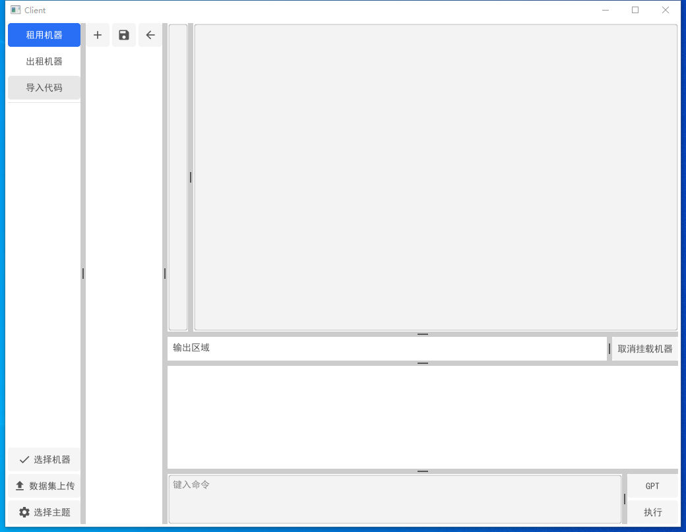
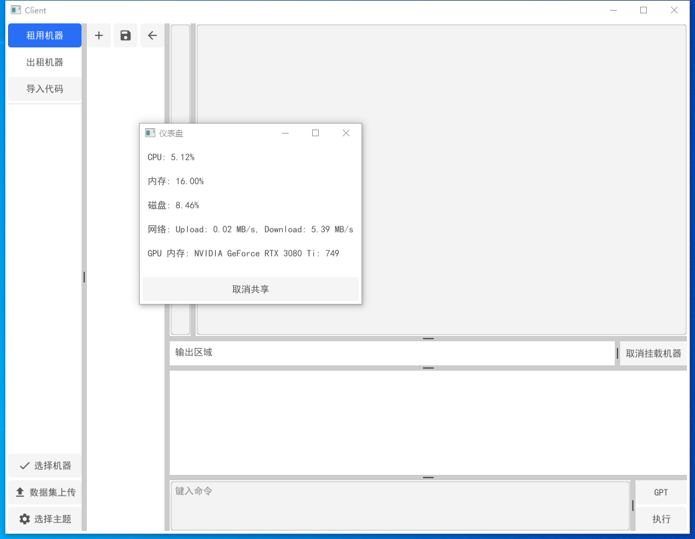

# 项目名称

**欢迎来到我们的项目！**我们的目的是为你提供一个稳定、方便的云平台，让你不仅可以在上面训练或者执行你的代码，还可以通过此途径来租用机器或者让自己的机器赚钱。

## 项目介绍

在当今社会，随着大数据和人工智能的飞速发展，数据分析及其后的处理成了人们日常生活中的重要组成部分。然而，这也意味着需要大量的计算资源。为了解决这个问题，我们搭建了一个允许用户在其中训练和执行代码的云平台，用户可以在这个平台上租用或者出租机器。这就是我们的项目。

## 功能特性

- 提供机器赚钱的平台

    作为机器的所有者，你可以将你的机器挂在我们的平台上，然后你就可以坐享其成，看着你的机器自动为你赚钱。

- 提供出租机器的服务

    作为需要机器的用户，你不需要做任何的硬件投入，也不需要关心运维等复杂的问题，只需要在我们平台上租用你需要的机器，然后就可以使用了。

- 提供云端执行环境的平台

    在这个平台上，用户可以在云端训练或执行他们的代码，无需担心本地计算资源不足的问题。

## 如何使用

1. 注册并登陆我们的平台账号。
2. 如果你想出租机器，只需要在我们的平台上发布你的机器信息，包括机器类型、租金等，然后我们的平台就会帮你找到合适的租户。
3. 如果你想租用机器，只需要在我们的平台上找到你想要的机器，然后支付相应租金，再进行租用即可。
4. 如果你想在平台上训练或执行你的代码，可在你租用的机器上进行。

## 技术支持

我们有专业的技术团队，愿意为你解决在使用平台期间遇到的任何问题。如果遇到问题，可以通过以下途径和我们联系，我们会及时为你解答。

- 邮箱：123@xyz.com
- 电话：123456

感谢你的使用！希望我们的平台可以帮助你更便捷地学习和工作。

## 开发工具

本产品是基于 Copilot Chat 开发的。我们感谢 Copilot Chat 提供的强大的编程助手功能，帮助我们更高效地开发软件。

## 许可证

本软件仅供个人学习和研究使用，禁止用于商业目的。使用本软件即表示你同意这些条款。